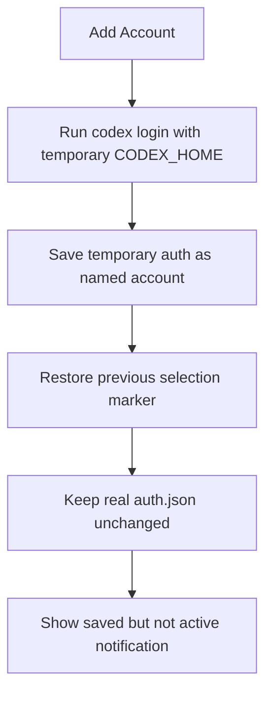

# Add Local Account

## Rules

| Rule | Behavior |
| --- | --- |
| No implicit switch | `Add Account` treats `codex login` as a transient capture step. After saving the new local account, the extension restores the selection that was active before login. |
| Isolated login capture | The add flow runs `codex login` with a temporary `CODEX_HOME`, then saves the captured temporary `auth.json` as the requested account. |
| Preserve current auth | The real `auth.json` is not overwritten by the transient login, so the account currently used by Codex keeps the same access token throughout the add flow. |
| Auth file compatibility | Local account reads accept both plaintext `AuthFile` JSON and encrypted `saved_auth` envelopes, so older unencrypted files and password-protected files can coexist. |
| Save notification | The success notification says the account is saved but not active yet, and directs users to `Switch Account` instead of offering reload actions. |
| Duplicate protection | If the transient login matches an already saved identity under another name, the add is rejected and the pre-login state is restored. |
| Quota separation | The post-add quota refresh never refreshes tokens; token refresh remains limited to the timer token-maintenance path or explicit refresh commands. |

## Implementation Notes

`saveAuthAsAccount` persists the transient login result directly from the temporary Codex home. Add-account calls it with `selectAfterSave: false`, avoiding account/provider switch helpers and avoiding any write of the transient login into the real `auth.json`.

Local saved-account reads now go through the same compatibility path for both plaintext `AuthFile` JSON and encrypted `saved_auth` envelopes, so enabling a storage password does not break existing unencrypted local account files.

The CLI `add` command follows the same rule: it runs `codex login` with a temporary `CODEX_HOME`, reads that temporary auth file, writes `auth_{name}.json`, and leaves the active account or provider mode untouched.

