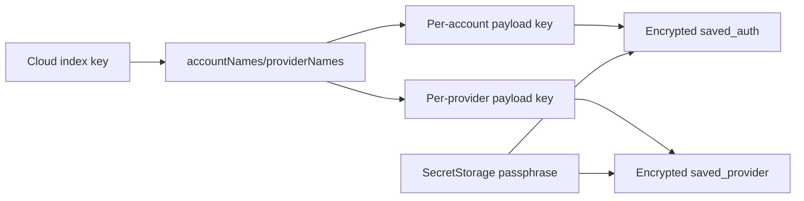
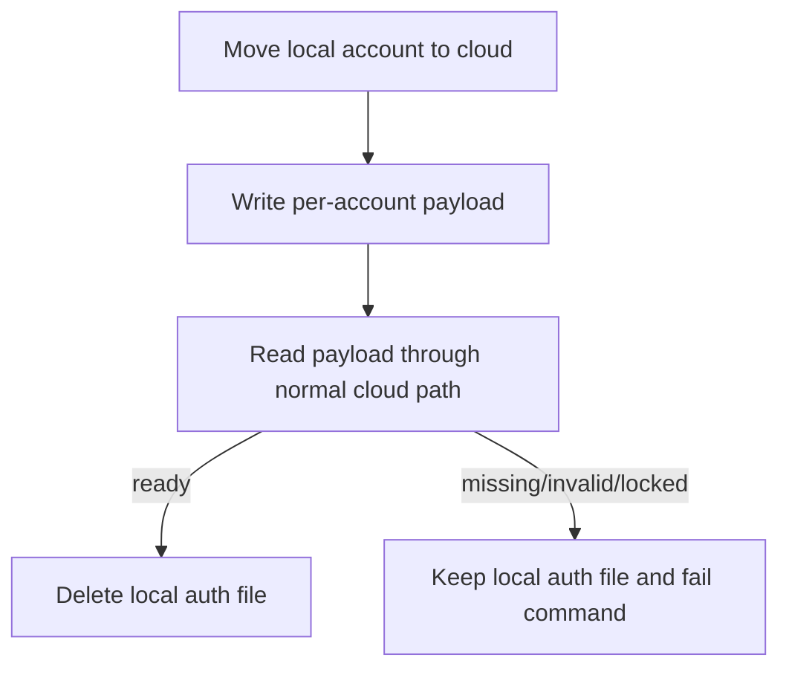

# Synced Cloud State 架构

## 存储拆分

| 组件 | 职责 |
| --- | --- |
| `codex-account-switch.syncedCloudState.v1` | 只保存账号和 Provider 名称索引，不保存 auth payload。 |
| `codex-account-switch.syncedCloudAccount.v1.{name}` | 保存单个账号的加密 `saved_auth` payload 和同步元数据。 |
| `codex-account-switch.syncedCloudProvider.v1.{name}` | 保存单个 Provider 的加密 payload 和审计元数据。 |

## 一致性规则

| 规则 | 行为 |
| --- | --- |
| 索引先到、payload 未到 | 账号显示 `Payload pending`，保留独立 key 注册，等待 Settings Sync 后续同步。 |
| payload 结构错误或无法解密 | 账号显示 invalid 或 locked，由具体反序列化结果决定。 |
| local 迁移到 cloud | 只有 cloud payload 读回成功后才删除本地 `auth_{name}.json`。 |
