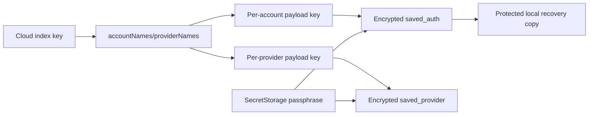
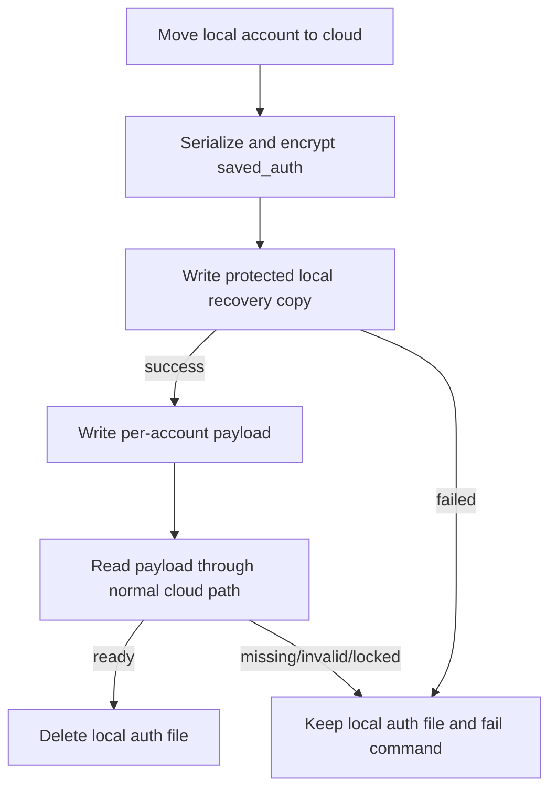
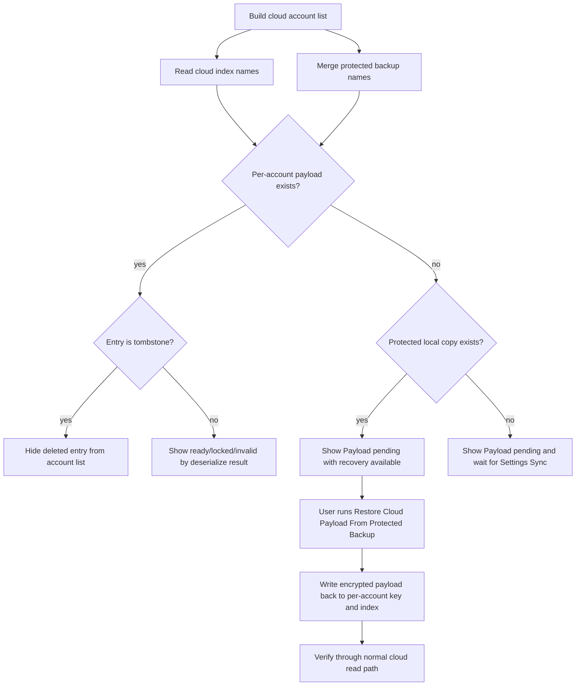

# Synced Cloud State 架构

## 存储拆分

| 组件 | 职责 |
| --- | --- |
| `codex-account-switch.syncedCloudState.v1` | 只保存账号和 Provider 名称索引，不保存 auth payload。 |
| `codex-account-switch.syncedCloudAccount.v1.{name}` | 保存单个账号的加密 `saved_auth` payload 和同步元数据。 |
| `codex-account-switch.syncedCloudProvider.v1.{name}` | 保存单个 Provider 的加密 payload 和审计元数据。 |
| `globalStorage/cloud-account-recovery/accounts/{name}.json` | 保存迁移到 cloud 后的加密账号 payload 保护副本，仅用于用户显式恢复。 |

VS Code Settings Sync 对 extension state 的合并不是账号级事务。真实同步可能出现 `accountNames` 保留了账号名，但对应独立 payload key 被合并结果移除的状态；因此本地 auth 文件删除前，必须先建立扩展私有的加密保护副本。
同时，VS Code API 不提供遍历扩展 `globalState` 已同步 key 的能力；因此 `accountNames/providerNames` 仍保留为发现入口，但不再被视为 payload 真值。

## 一致性规则

| 规则 | 行为 |
| --- | --- |
| 普通 cloud 写入必须显式携带同步基线 | 调用方必须给出 `expectedEntryVersion`；新建 cloud entry 也必须显式声明“期望当前不存在”，不能无基线覆盖。 |
| 缺失 payload 不自动补写 | 版本化 marker、本地旧快照、保护副本都不能在后台自动写回缺失 payload；只有显式恢复命令可以写回。 |
| 删除 cloud entry 使用 tombstone | 删除账号或 Provider 时，写入带更高 `entryVersion` 的 tombstone，而不是直接物理删除 key；旧 payload 不能靠后续同步复活。 |
| 索引先到、payload 未到 | 账号显示 `Payload pending`，保留独立 key 注册，等待 Settings Sync 后续同步。 |
| 索引保留、payload 被同步合并移除、保护副本存在 | 账号显示 `Payload pending` 且标记可恢复；只有用户显式执行恢复命令时才写回 cloud payload。 |
| 索引和 payload 都被同步合并移除、保护副本存在 | 账号仍从保护副本目录显示为 `Payload pending` 且标记可恢复；只有用户显式执行恢复命令时才写回 cloud index 和 payload。 |
| payload 结构错误或无法解密 | 账号显示 invalid 或 locked，由具体反序列化结果决定。 |
| payload 仍在但 index 丢失 | 受 VS Code `globalState` API 限制，扩展无法枚举未知 per-entry key；如果名称仅存在于未登记的 payload key 中，扩展不会自动发现它。 |
| 直接新增 cloud account | 写入独立 payload 后必须通过普通 cloud 读取路径读回验证；验证失败时不把保存结果当作成功，并保留保护副本供显式恢复。 |
| local 迁移到 cloud | 只有保护副本写入成功且 cloud payload 读回成功后，才删除本地 `auth_{name}.json`。 |
| 删除 cloud account 或移动回 local | 写入 tombstone，并同步清理对应保护副本，避免保留用户已明确删除的数据。 |
