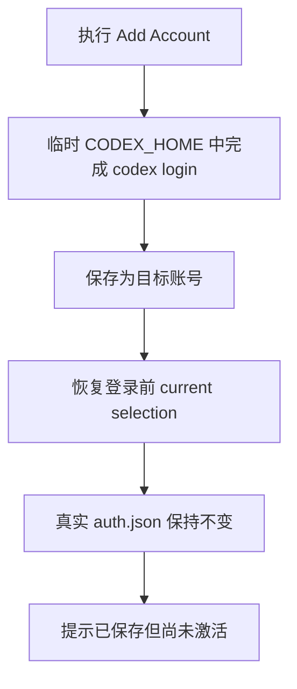

# Add Local Account 验收用例

| 场景 | 前置条件 / 输入 | 预期结果 |
| --- | --- | --- |
| 新增 local account | 用户当前正在使用已保存的 local account，执行 `Add Account` 并完成 `codex login` | 新登录结果保存为目标 local account；插件恢复登录前的 current selection 和 `auth.json`，不自动切换到新增账号。 |
| 新增账号成功提示 | `Add Account` 保存新账号成功 | 弹窗只提示账号已保存但尚未激活，需要通过 `Switch Account` 手动切换；不显示 `Reload` / `Later` 操作，不暗示重载后会立即使用新账号。 |
| 新增 local account 时隔离登录 | 用户当前正在使用 cloud account `google1`，执行 `Add Account` 新增 `bob1990` | `codex login` 只写入临时 `CODEX_HOME/auth.json`；真实 `auth.json` 仍为 `google1`；cloud 中的 `google1` auth 不被 `bob1990` 登录结果覆盖。 |
| 新增账号重复 | 用户当前正在使用已保存的 local account，新增流程登录到了一个已保存的相同身份账号 | 新目标账号不创建；登录前的 current selection 和 `auth.json` 被恢复；已保存旧账号文件不被临时登录 token 覆盖。 |
| 新增账号后的 quota 刷新 | 新增 local account 保存成功后触发视图刷新 | quota 查询只使用各账号当前可用 token 或缓存；不触发 token refresh；旧 current account 的 access token 不因新增账号流程改变。 |
| CLI 新增账号 | 用户当前真实 `auth.json` 为 `google1`，运行 `codex-account-switch add bob1990` 并完成网页登录 | CLI 将 `bob1990` 保存为 `auth_bob1990.json`，真实 `auth.json` 仍为 `google1`，当前账号不被隐式切换。 |
