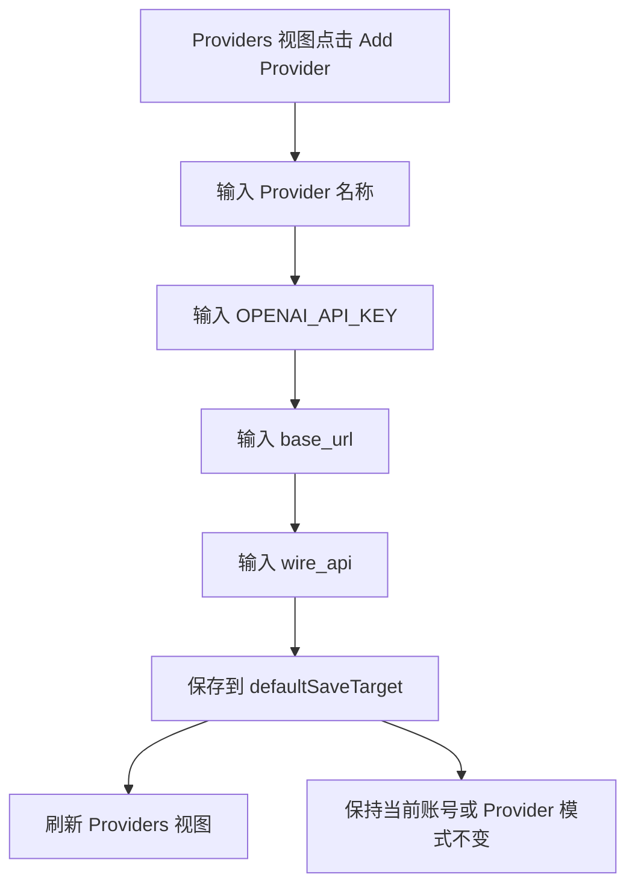

# Add Provider 验收用例

| 场景 | 前置条件 / 输入 | 预期结果 |
| --- | --- | --- |
| Providers 标题栏新增入口 | 用户打开 Providers 视图 | 标题栏显示 `Add Provider` 按钮；空态欢迎内容也提供 `Add provider` 命令链接。 |
| 新增 local provider | `defaultSaveTarget` 为 `local`，用户输入名称、`OPENAI_API_KEY`、`base_url`、`wire_api` | 创建 `provider_{name}.json`，Providers 视图刷新并显示新 provider。 |
| 新增 provider 不切换模式 | 用户当前处于账号模式或已有 Provider 模式，执行 `Add Provider` | 只保存 provider profile，不写入当前 `model_provider`，不隐式切换到新 provider。 |
| provider 名称重复 | 目标存储中已存在同名 provider | 不覆盖原 provider profile，提示同名 provider 已存在。 |
| cloud provider 缺少存储密码 | `defaultSaveTarget` 为 `cloud` 且未配置本地存储密码 | 不创建 cloud provider，提示 cloud storage 需要本地存储密码。 |
