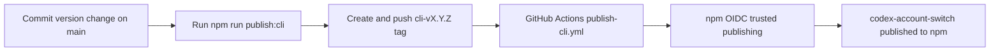

# Deployment

## Release Paths

| Target | Package | Trigger | Credentials | Notes |
| --- | --- | --- | --- | --- |
| npm | `packages/cli` | Push `cli-v<version>` tag or run `.github/workflows/publish-cli.yml` manually | npm Trusted Publisher via GitHub OIDC | `packages/cli/package.json` version must match the Git tag. |
| Visual Studio Marketplace | `packages/vscode` | Local `npm run publish:vscode` | `VSCE_PAT` | Publishes the VS Code extension directly. |
| Open VSX | `packages/vscode` | Local `npm run publish:vscode:openvsx` | `OVSX_PAT` or `OPEN_VSX_TOKEN` | Publishes the prebuilt VSIX. |

## npm Trusted Publisher Flow



## npm Package Trust Configuration

Configure npm Trusted Publisher once for `codex-account-switch` with the GitHub repository metadata below.

| Field | Value |
| --- | --- |
| Owner | `jqknono` |
| Repository | `codex-account-switch` |
| Workflow file | `publish-cli.yml` |
| Branch | `main` |
| Environment | leave empty |

You can register the trust with the npm CLI:

```bash
npm trust github codex-account-switch --repo jqknono/codex-account-switch --file publish-cli.yml
```

## CLI Release Procedure

| Step | Command | Verification |
| --- | --- | --- |
| Install dependencies | `npm ci` | command succeeds |
| Rehearse the GitHub workflow locally in WSL | `npm run verify:publish:cli` | downloads Linux Node toolchain if needed, runs the CLI release tests, and finishes with `npm publish --dry-run` |
| Run CLI release tests | `npm run test -w packages/cli` | the publishable CLI package passes its integration suite |
| Confirm target version | `node -p "require('./packages/cli/package.json').version"` | version is the one you intend to publish |
| Trigger release | `npm run publish:cli` | pushes tag `cli-v<version>` |
| Verify published package | `npm view codex-account-switch version` | npm reports the new version |

## Rollback

| Situation | Action |
| --- | --- |
| Tag pushed, workflow not started | Verify the tag exists on `origin` and the workflow file path matches the npm Trusted Publisher binding. |
| Workflow failed before publish | Fix the branch/workflow/package metadata mismatch, then push a new version commit and a new `cli-v<version>` tag. |
| Incorrect package already published | Publish a corrective version; do not overwrite an existing npm version. |
