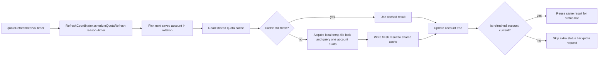

# Rotating Quota Auto Refresh

## Responsibilities

| Area | Owner | Notes |
| --- | --- | --- |
| Background quota timer | `RefreshCoordinator` | Extension-level single timer, keyed by `codex-account-switch.quotaRefreshInterval`. |
| Rotation target resolution | `RefreshCoordinator` + saved snapshot | 每次 tick 只选中 1 个可用 saved account，按轮转方式推进。 |
| Shared quota cache | `quotaCache.ts` | 使用本机临时目录中的共享文件保存最近一次成功 quota 结果与查询时间，供多个 VS Code 实例复用。 |
| Account tree refresh | `AccountTreeProvider` | 只负责渲染与执行目标 quota 查询，不再维护自己的 timer。 |
| Status bar refresh | `StatusBarManager` | 只负责展示与 `showStatusBar` 配置联动；timer 轮到非当前账号时不额外发起 quota 请求。 |
| Group refresh action | `refreshQuota` command | 支持从 `Local Accounts` / `Cloud Accounts` 分组节点一次刷新组内全部账号 quota。 |
| Token auto update | `savedEntries.ts` | local / cloud 共用 `tokenAutoUpdate` 与 `tokenAutoUpdateIntervalHours`；自动 quota 刷新只在满足条件时回写 saved account。 |

## Refresh Flow

## Rules

| Rule | Behavior |
| --- | --- |
| Default interval | `300` seconds, equivalent to `3 min`. |
| Config update | `quotaRefreshInterval` 变更后立即重建后台 timer。 |
| One account per tick | 每个 timer 周期只刷新 1 个 saved account 的 quota。 |
| Rotation order | 默认从当前账号的下一个 saved account 开始，之后按稳定顺序轮转。 |
| Cache-first display | 账号树优先尝试从共享 cache 恢复最近一次成功 quota 结果，降低 `No data` 概率。 |
| Shared throttling | 如果最近一次成功查询距今小于 `quotaRefreshInterval`，新窗口/新实例优先使用 cache，不重复打 quota API。 |
| Cross-window coordination | 当多个 VS Code 实例同时需要同一账号 quota 时，使用临时 lock 文件减少重复查询。 |
| Failure fallback | 新查询失败但 cache 中已有最近一次成功结果时，优先继续显示缓存数据。 |
| Current status bar | 只有轮到当前账号时才复用同一次 quota 查询更新状态栏。 |
| Shared token auto update | local / cloud 的自动 token 回写共用 `tokenAutoUpdate*` 设置；如果本轮跳过 saved account 回写，但该账号正处于激活状态，`auth.json` 仍会更新到最新 token。 |
| Full-cycle cost | 如果有 `N` 个 saved accounts，则完整轮转一轮约需 `N * quotaRefreshInterval`。 |
| In-flight coalescing | 当前轮刷新未结束时，新的自动目标刷新请求进入队列，待当前轮完成后继续执行。 |
