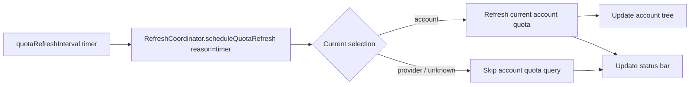

# Current Account Quota Auto Refresh

## Responsibilities

| Area | Owner | Notes |
| --- | --- | --- |
| Background quota timer | `RefreshCoordinator` | Extension-level single timer, keyed by `codex-account-switch.quotaRefreshInterval`. |
| Current account target resolution | `RefreshCoordinator` + saved snapshot | 每次 tick 只解析当前选中的 account，不做全量 quota 轮询。 |
| Account tree refresh | `AccountTreeProvider` | 只负责渲染与执行目标 quota 查询，不再维护自己的 timer。 |
| Status bar refresh | `StatusBarManager` | 只负责展示与 `showStatusBar` 配置联动，不再维护自己的 timer。 |

## Refresh Flow

## Rules

| Rule | Behavior |
| --- | --- |
| Default interval | `300` seconds, equivalent to `3 min`. |
| Config update | `quotaRefreshInterval` 变更后立即重建后台 timer。 |
| Current account only | timer 刷新只针对当前使用中的 account，不做全量账户列表轮询。 |
| In-flight coalescing | 当前轮刷新未结束时，新的自动目标刷新请求进入队列，待当前轮完成后继续执行。 |
