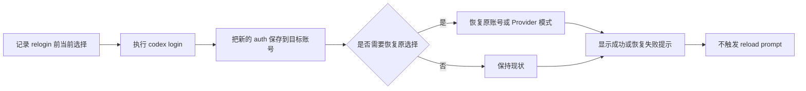

# Relogin Account

## Expected Behavior

| 动作 | 当前使用账号 | 保存账号 | UI 行为 |
| --- | --- | --- | --- |
| `relogin` 非当前账号 | 保持不变 | 覆盖目标账号的保存认证 | 成功后只提示已更新，不提示 reload。 |
| `relogin` 当前账号 | 保持同一账号 | 覆盖当前账号的保存认证 | 成功后只提示已更新，不提示 reload。 |

## Flow

