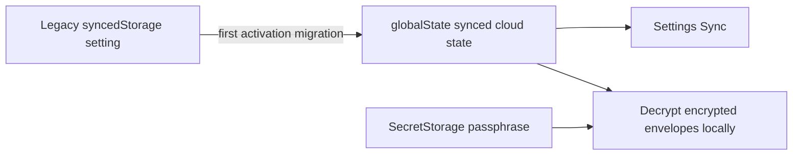

# Synced Cloud State

## Responsibilities

| Area | Storage | Notes |
| --- | --- | --- |
| Cloud accounts | VS Code `globalState` synced key | Payload stays encrypted with the saved-auth passphrase. |
| Cloud providers | VS Code `globalState` synced key | Uses the same encrypted envelope format as accounts. |
| Device list | VS Code `globalState` synced key | Shared across machines through Settings Sync. |
| Auto-refresh device | VS Code `globalState` synced key | Syncs with the rest of the cloud state. |
| Saved-auth passphrase | VS Code `SecretStorage` | Local-only secret, never synced. |
| Current selection marker | VS Code `globalState` unsynced key | Per-device UI state. |

## Sync Behavior

## Migration Rules

| Rule | Behavior |
| --- | --- |
| New synced key already exists | Use it as the only source of truth. |
| New synced key missing and legacy setting has data | Copy the full legacy object into synced `globalState`. |
| Legacy cleanup succeeds | Remove the old `codex-account-switch.syncedStorage` setting. |
| Legacy cleanup fails | Keep the migrated `globalState` data active, log a warning, and show a non-fatal notice. |

## Constraints

| Constraint | Effect |
| --- | --- |
| No `globalState` change event for remote sync | Reload/activation or explicit refresh is the supported pickup boundary. |
| Passphrase is local-only | A second machine must enter the same password before synced cloud entries can be decrypted. |
| Envelope format must stay unchanged | `@codex-account-switch/core` remains the canonical serializer/deserializer. |
