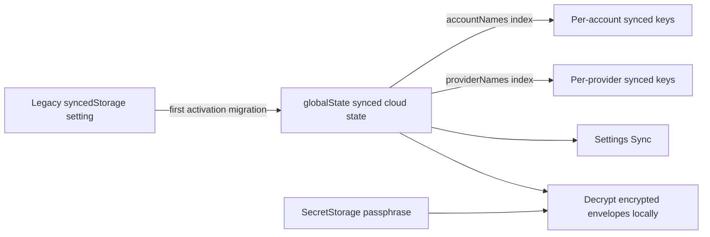
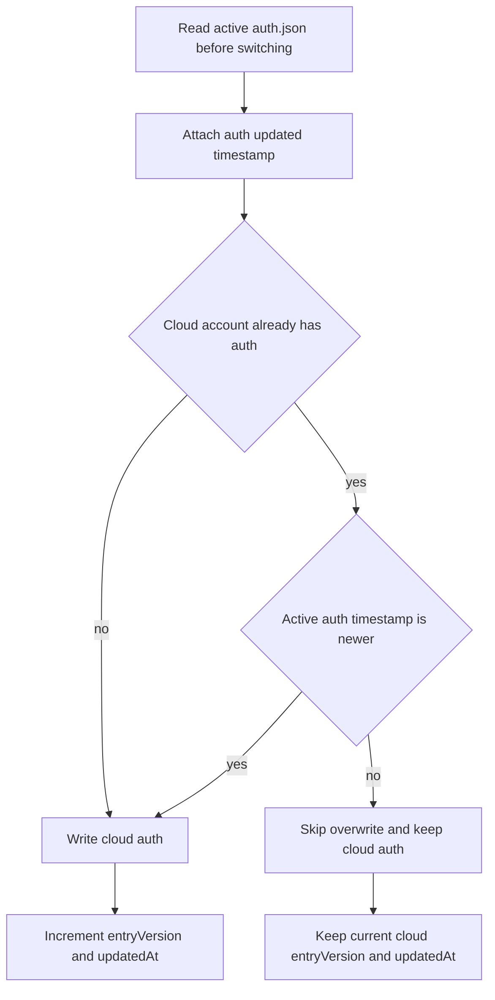

# Synced Cloud State

## Responsibilities

| Area | Storage | Notes |
| --- | --- | --- |
| Cloud account index | VS Code `globalState` synced key `codex-account-switch.syncedCloudState.v1` | Stores account names plus shared cloud metadata; account payloads are not stored in this aggregate key. |
| Cloud accounts | Per-account VS Code `globalState` synced keys `codex-account-switch.syncedCloudAccount.v1.{name}` | Payload stays encrypted with the saved-auth passphrase; updating one account does not rewrite sibling accounts. |
| Cloud providers | Per-provider VS Code `globalState` synced keys `codex-account-switch.syncedCloudProvider.v1.{name}` | Uses the same encrypted envelope format as accounts, plus sync revision metadata and provider audit metadata (`lastWriterAction`). |
| Saved-auth passphrase | VS Code `SecretStorage` | Local-only secret, never synced. |
| Current selection marker | VS Code `globalState` unsynced key | Local UI state. |
| Account auth freshness | `codex_account_switch_auth_updated_at` inside account auth | Internal timestamp used to reject stale auth writes when multiple machines sync the same cloud account. |

## Sync Behavior

```mermaid
flowchart LR
  A[Legacy syncedStorage setting] -->|first activation migration| B[globalState synced cloud state]
  B -->|accountNames index| I[Per-account synced keys]
  B -->|providerNames index| J[Per-provider synced keys]
  B --> D[Settings Sync]
  G[SecretStorage passphrase] --> H[Decrypt encrypted envelopes locally]
  B --> H
```

## Cloud Account Auth Freshness

```mermaid
flowchart TD
  A[Read active auth.json before switching] --> B[Attach auth updated timestamp]
  B --> C{Cloud account already has auth}
  C -->|no| D[Write cloud auth]
  C -->|yes| E{Active auth timestamp is newer}
  E -->|yes| D
  E -->|no| F[Skip overwrite and keep cloud auth]
  D --> G[Increment entryVersion and updatedAt]
  F --> H[Keep current cloud entryVersion and updatedAt]
```

| Rule | Behavior |
| --- | --- |
| Cloud account writes | Persisted account auth carries `codex_account_switch_auth_updated_at`. |
| Switching to a cloud account | The copied `auth.json` keeps the cloud auth timestamp, or uses the cloud entry `updatedAt` for older entries that do not yet contain the field. |
| Syncing current auth back to cloud | The cloud entry is overwritten only when the active auth timestamp is strictly newer than the stored cloud auth timestamp. |
| Stale active auth | If another machine has already synced newer auth for the same account, switching away from the stale active account skips the cloud overwrite and keeps the newer cloud auth. |

## Migration Rules

| Rule | Behavior |
| --- | --- |
| New synced key already exists | Use it as the only source of truth. |
| New synced key missing and legacy setting has data | Copy legacy entries into per-account/per-provider synced `globalState` keys and keep only index metadata in the aggregate key. |
| Aggregate key contains legacy payloads | Materialize missing per-entry keys, prefer already-existing per-entry keys, then clear aggregate `accounts` and `providers`. |
| Multiple sources contain the same entry | Prefer payloads with `entryVersion`; when more than one source has a version, keep the highest version and materialize it into the per-entry key. |
| Local operation snapshot has a newer version | Use the versioned local snapshot as the write baseline when current synced storage is missing or older, then write the next version. |
| Index name has no payload | Preserve the name and keep its per-entry key registered for sync; treat it as a pending payload rather than deleting it. |
| Directly saving a new cloud account | After writing the per-account payload, read it back through the normal cloud account path. If read-back fails, report the cloud save as unverified and keep the protected backup for explicit restore. |
| Local account moves to cloud | After writing the per-account payload, read it back through the normal cloud account path before deleting the local `auth_{name}.json`. If read-back fails, keep the local auth and report the cloud write as unverified. |
| Legacy cleanup succeeds | Remove the old `codex-account-switch.syncedStorage` setting. |
| Legacy cleanup fails | Keep the migrated `globalState` data active, log a warning, and show a non-fatal notice. |

## Legacy Device Fields

| Rule | Behavior |
| --- | --- |
| Legacy `devices` exists | Ignore it during migration, activation, refresh, and UI rendering. |
| Legacy `autoRefreshDeviceName` exists | Ignore it; any machine with the saved-auth passphrase may refresh and persist cloud tokens. |
| New writes | Do not write `devices`, `autoRefreshDeviceName`, or provider `lastWriterDeviceName`. |

## Constraints

| Constraint | Effect |
| --- | --- |
| No `globalState` change event for remote sync | Reload/activation or explicit refresh is the supported pickup boundary. |
| Passphrase is local-only | A second machine must enter the same password before synced cloud entries can be decrypted. |
| Index and payload may arrive separately | A device can temporarily see `accountNames/providerNames` before the matching per-entry payload key; that state must not be interpreted as deletion. |
| Names-only cloud accounts are pending | A cloud account whose index is present but payload is missing is displayed as `Payload pending`, not as invalid saved auth. |
| Envelope format must stay unchanged | `@codex-account-switch/core` remains the canonical serializer/deserializer. |
| Account/provider writes are per-entry | Updating one cloud account or provider must not rewrite sibling payload keys. |
| New per-entry sync keys must be registered before payload writes | Otherwise another device can sync `accountNames/providerNames` first and temporarily see a names-only invalid entry. |
| Public account email | Stored unencrypted on each cloud account entry so locked entries can still show the email; tokens remain encrypted. |
| VS Code internal caches stay private | The extension does not read `state.vscdb` or other VS Code internal storage; if data is only present there, automatic migration is abandoned. |

## Provider Audit Metadata

| Field | Scope | Meaning |
| --- | --- | --- |
| `lastWriterAction` | Cloud provider entry | Action that last wrote the provider entry, such as `save_provider_profile`, `sync_current_provider_auth`, or `move_provider_to_cloud`. |

| Write Path | Stored `lastWriterAction` |
| --- | --- |
| Manual create or edit of a cloud provider profile | `save_provider_profile` |
| Switching away from the active cloud provider and syncing its auth | `sync_current_provider_auth` |
| Moving a local provider into cloud storage | `move_provider_to_cloud` |
