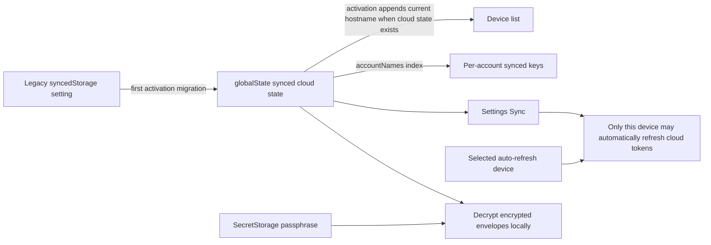

# Synced Cloud State

## Responsibilities

| Area | Storage | Notes |
| --- | --- | --- |
| Cloud account index | VS Code `globalState` synced key `codex-account-switch.syncedCloudState.v1` | Stores account names plus shared cloud metadata; account payloads are not stored in this aggregate key. |
| Cloud accounts | Per-account VS Code `globalState` synced keys `codex-account-switch.syncedCloudAccount.v1.{name}` | Payload stays encrypted with the saved-auth passphrase; updating one account does not rewrite sibling accounts. |
| Cloud providers | VS Code `globalState` synced key | Uses the same encrypted envelope format as accounts, plus sync revision metadata and provider audit metadata (`lastWriterDeviceName`, `lastWriterAction`). |
| Device list | VS Code `globalState` synced key | Shared across machines through Settings Sync. |
| Auto-refresh device | VS Code `globalState` synced key | Controls which synced device may perform automatic cloud token refresh. |
| Saved-auth passphrase | VS Code `SecretStorage` | Local-only secret, never synced. |
| Current selection marker | VS Code `globalState` unsynced key | Per-device UI state. |

## Sync Behavior

```mermaid
flowchart LR
  A[Legacy syncedStorage setting] -->|first activation migration| B[globalState synced cloud state]
  B -->|activation appends current hostname when cloud state exists| C[Device list]
  B -->|accountNames index| I[Per-account synced keys]
  B --> D[Settings Sync]
  E[Selected auto-refresh device] --> F[Only this device may automatically refresh cloud tokens]
  D --> F
  G[SecretStorage passphrase] --> H[Decrypt encrypted envelopes locally]
  B --> H
```

## Migration Rules

| Rule | Behavior |
| --- | --- |
| New synced key already exists | Use it as the only source of truth. |
| New synced key missing and legacy setting has data | Copy the full legacy object into synced `globalState`. |
| Legacy cleanup succeeds | Remove the old `codex-account-switch.syncedStorage` setting. |
| Legacy cleanup fails | Keep the migrated `globalState` data active, log a warning, and show a non-fatal notice. |

## Device Registration

| Rule | Behavior |
| --- | --- |
| Activation sees existing synced cloud state | Append the current hostname into `devices` if it is missing. |
| Activation runs again on the same machine | Keep a single entry for that hostname; do not duplicate it. |
| Synced cloud state is still empty | Do not create a device record just because the extension activated once. |
| `autoRefreshDeviceName` is unset | The first synced device remains the effective refresh authority until the user explicitly changes it. |
| Current machine is not the selected auto-refresh device | This machine can still read synced entries and appear in the device list, but it must not persist automatically refreshed cloud tokens. |

## Constraints

| Constraint | Effect |
| --- | --- |
| No `globalState` change event for remote sync | Reload/activation or explicit refresh is the supported pickup boundary. |
| Passphrase is local-only | A second machine must enter the same password before synced cloud entries can be decrypted. |
| Envelope format must stay unchanged | `@codex-account-switch/core` remains the canonical serializer/deserializer. |
| Account writes are per-entry | Updating one cloud account must not rewrite other cloud account payload keys. |

## Provider Audit Metadata

| Field | Scope | Meaning |
| --- | --- | --- |
| `lastWriterDeviceName` | Cloud provider entry | Hostname of the device that last wrote the provider entry. |
| `lastWriterAction` | Cloud provider entry | Action that last wrote the provider entry, such as `save_provider_profile`, `sync_current_provider_auth`, or `move_provider_to_cloud`. |

| Write Path | Stored `lastWriterAction` |
| --- | --- |
| Manual create or edit of a cloud provider profile | `save_provider_profile` |
| Switching away from the active cloud provider and syncing its auth | `sync_current_provider_auth` |
| Moving a local provider into cloud storage | `move_provider_to_cloud` |
