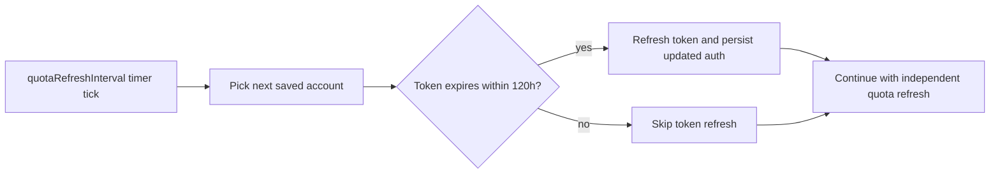

# Token Auto Refresh

## Responsibilities

| Area | Owner | Notes |
| --- | --- | --- |
| Background token check | `RefreshCoordinator` | Uses the extension background timer and checks one saved account per rotation step. |
| Threshold evaluation | `RefreshCoordinator` | Refreshes when access token is expired, within `120h`, or when a decodable refresh token is within `120h`. |
| Token refresh execution | `refreshSavedAccountEntry` | Reuses the same write-back path as manual `Refresh Token`. |
| Cloud account refresh | `refreshSavedAccountEntry` | Cloud saved accounts may refresh from any machine that can decrypt the synced entry. |
| Quota separation | `AccountTreeProvider` + `querySavedAccountQuota` | Quota refresh never refreshes tokens by itself. |

## Flow

## Rules

| Rule | Behavior |
| --- | --- |
| Threshold | `120` hours (`5` days). |
| Rotation | Each timer step checks at most `1` saved account for token refresh. |
| Local accounts | Automatic token refresh is always allowed. |
| Cloud accounts | Automatic token refresh is allowed on any machine with access to the saved-auth passphrase. |
| Manual refresh | `Refresh Token` follows the same cloud write-back path and is not limited by legacy device fields. |
| Quota refresh | Manual or timer-driven quota refresh does not trigger token refresh unless the background token check already did so before the quota step. |
| Re-login required | If token refresh returns `refresh_token_reused` or an equivalent sign-in-again error, the account is marked `Relogin required` and the timer skips quota for that account in the current step. |
